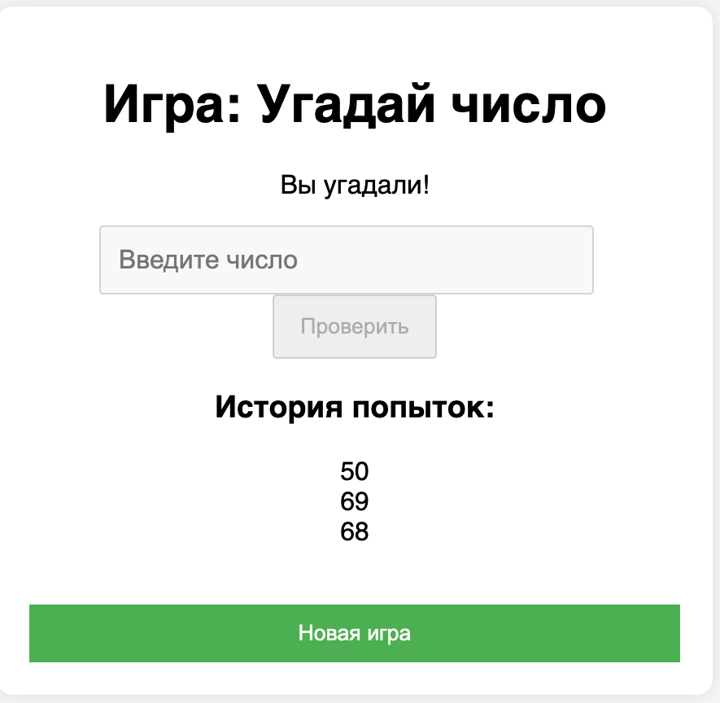
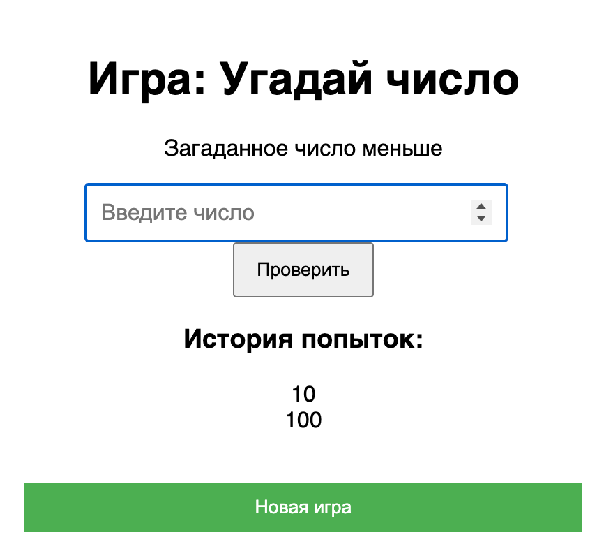

# Мини-игра «Угадай число»

Цель игры — угадать случайное число от 1 до 100, получая подсказки после каждой попытки.

---

## Функционал

- Случайное число от 1 до 100  
- Подсказки: число больше / меньше  
- История всех попыток  
- Возможность начать новую игру  
- Сохранение прогресса в localStorage  

## Скриншоты

Вы угадали

Загаданное число больше

Загаданное число меньше

---

## Установка и запуск

- git clone https://github.com/AUKYJL/tipkr4.git
- cd ./tipkr4
- npm i
- npm run dev
